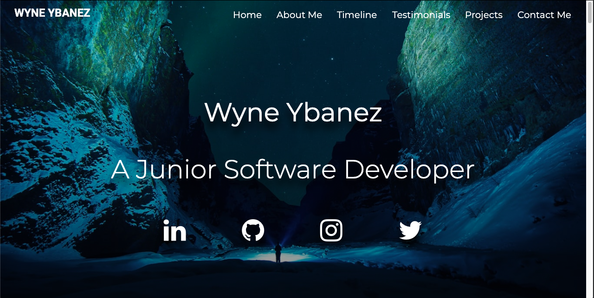

# Code Institute MS1: Personal Portfolio Project

[View the live project here.](https://wyne-ybanez.github.io/personal-portfolio-master/)

## Project Goal

This project aims to portray a junior software developer in the best light personally, technically and professionally. It should show the personality of the person, what skills and experience they have obtained throughtout their professional life as a developer. The project ultimately intends to pitch the junior developer as an asset to hiring businesses/companies. 

For the purpose of this project, the content used to portray the candidate's potential will be fictional. 

## UX 

- ### User Stories:

- ### First Time Visitor Goals:

  1. I would like to know the purpose for the creation of the website from the first instance of opening it.
  2. I would greatly appreciate it if the website were easy to navigate.
  3. I expect the website to display relevant content and stay consistently relevant as I explore the site.
  4. I would appreciate it if my interactions with the site were acknowledged so that I know what I am doing and where I am going. 
  5. I would like the content to be structured and easy to follow.
  
- ### Returning Visitor Goals:
  
  1. I would like to see in-depth information to the website with regards to how the candidate is improving in his ability to code. 
  2. I would like to see if the candidate has completed any coding experience with other businesses.
  3. I would like to it if there were a way to contact the candidate and find out more information.

- ### Frequent Visitor Goals: 
  
  1. I would like to check if the candidate is working on any projects.
  2. I want to be able to contact the candidate quickly.
  3. I want to be able to navigate to any section of the website in order to read it in more detail.

<br>

## Design

### Colour Scheme 
- The overall projec will have a black background.
- The two main contrasting colours for the project is blue green and blue with white texts.

### Fonts 
- Montserrat is the font used for the body, it looks clean and professional.
- Roboto is the secondary font - used mainly for headings.
- Sans serif is the fallback font should the fonts be imported incorrectly.

### Separated pages 
- Separate pages such as contactme.html and projects.html will have a background with a dark linear gradiet. This avoids distraction.
- Making it darker like index.html but also having a unique image in the back to make the page interesting rather than have it all black.
  

### Opening the website: 

[Click Here - Hero Image Wireframe](assets/readMe/hero-img.png)

- The website should be consistent and objective. It should avoid straying away from promoting the candidate, this may create confusion. 



### About Me:

[Click Here - About me Wireframe](assets/readMe/about-me.png)

- This section of the page will have a call to action buttons, mainly to project.html and contactme.html. 
  
- Should at any point the user feels that they would like to see my projects or contact me. This shortcut shall be provided. 
  


### Work History Timeline: 

[Click Here - Timeline Wireframe](assets/readMe/timeline.png) 

- Time line of past work experience.
  


### Transparent Sticky-Navbar: 

[Click Here - Sticky Navbar Wireframe](assets/readMe/sticky-navbar.png)

- If at any point the user should find themselves lost whilst navigating the website, they should be able to return to the home page or to the page they would like to view easily. 

- Users should be able to traverse to any section of the website at any point in time.

### Contact Form: 

[Click here - Contact Me Wireframe](assets/readMe/contact-me.png)

- It would be efficient if there was a way for users to contact the candidate at any point of whilst traversing their website. There is a button placed on the navbar to help with this.
- This feature will require the user to input their contact details via a contact form. 
- Name and the email address is required. 
- If the candidate should ever respond, he/she will then know where/who the response is going to. 


### Projects: 

[Click Here - Projects Wireframe](assets/readMe/projects.png)
  
- It will display 4 projects. The projects will for the mean time link to external third-party websites however, in future I will link my other completed projects to this section.

- It will consist of 4 projects supported by descriptive text at the side.


### Footer:

[Click Here - Footer Wireframe](assets/readMe/footer.png)
- 3 buttons, to return to the top of the page, to check candidates projects, to contact the candidate.
  
- When reaching the end point of the website, there may be a further queries users would like to ask the candidate or know more about. 
  
- The 'contact me' and 'projects' buttons are present in preparation for this.

- The footer should have the relevant social links and buttons. These can help users/recruiters to research candidate further. 


<br>

## Features

### Responsive: 

- The website should be responsive and confirm all interactions. 
- There should be some sort of indicator or animation that can confirm whenever the user is hovering over a button or clicking on it when using a computer or desktop.
- It should shrink it's windows and align items correctly when the user is minimzing the window or using a mobile phone. 
- The website should function accordingly in modern web browsers.

### Interactive: 

- The user should be able to interact with the website and function according to the given text
  i.e. Clicking on 'Contact Me' should bring the user to 'contact.html'.
- Fade animations should be present on accordingly as the user scrolls down.
  
### Convenient: 

- The user should be able to navigate the website at any point in time.
- The content of the website should stay relevant and appropriate. 
- The buttons leading to separate pages should appear in good time in preparation for the user's desire to know more about the candidate.
- The content should be clear and presented without any distractions. The user should know where and what part of the website they are reading/exploring.
  
<br>

## Testing 
  
- I have added the testing onto a separate .md file, here is the [Testing link](TESTS.md)

<br>

## Technologies used:

### Languages
-  [HTML5](https://en.wikipedia.org/wiki/HTML5)
-  [CSS3](https://en.wikipedia.org/wiki/Cascading_Style_Sheets)
  
### IDE
- [VScode:](https://code.visualstudio.com/) - The IDE used to code the website. 
- VSCode extension: [LiveServer](https://marketplace.visualstudio.com/items?itemName=ritwickdey.LiveServer)

### Frameworks, Libraries, CDN's
1. [AOS:](https://michalsnik.github.io/aos/) 
    - This JS library was used for the animations on scroll.
2. [HVR:](https://github.com/IanLunn/Hover/blob/master/css/hover.css)
    - This library was used for the hover effects of the navbar items.
3. [Bootstrapv4.5.3:](https://getbootstrap.com/) 
    - Bootstrap was used for the overall design and responsiveness of the website.
4. [Balsamiq:](https://balsamiq.com/)
    - Balsamiq was used to create the wireframes during the design process.
5. [GitHub:](https://github.com/)
    - GitHub is used to store the projects code after being pushed from Git.
6. [Git](https://git-scm.com/)
    - Git was used for version control by utilizing the Gitpod terminal to commit to Git and Push to GitHub.
7. [Font Awesome:](https://fontawesome.com/)
    - Font Awesome was used on all pages throughout the website to add icons for aesthetic and UX purposes.
8. [Google Fonts:](https://fonts.google.com/)
    - Google fonts were used to import 'Roboto' and 'Montserrat' as the chosen styled fonts for the site.
  
<br>

## Deployment

### Github

1. Log into Github and Locate the relevant repository. In this case '[personal-portfolio-master](https://github.com/wyne-ybanez/personal-portfolio-master)'  
2. Click on the settings buttons on the horizontal menu
3. Scrolling down until you reach "Github pages" 
4. There is a heading named "Source". There is a button underneath it. Click on that button and change it from "none" to "main". Then click "save"
5. Once the page refreshes, you will have to scroll down to "Github Pages". The published [site](https://wyne-ybanez.github.io/personal-portfolio-master/) with the link should be there.   

### Forking the Repository

You can fork the repository through the following steps. Forking the repository means you will have a copy of the repository and any changes you make will not affect the original repository.

1. Log in to GitHub and locate the GitHub Repository
2. At the top of the Repository (not top of page) just above the "Settings" Button on the menu. Looking towards the right of the page. Locate the button "Fork" then click 
3. You should now have a copy of the original repository in your GitHub account

### Local Clone

1. Log in to GitHub and locate the relevant repository. In this case [personal-portfolio-master](https://github.com/wyne-ybanez/personal-portfolio-master)
2. To clone the repository using HTTPS, under "Clone with HTTPS", copy the link
3. Open a new terminal on Git Bash
4. Type `git clone`, and then paste the URL you copied in Step 2

```
$ git clone https://github.com/wyne-ybanez/personal-portfolio-master
```

7. Press Enter. Your local clone will be created.

```
$ git clone https://github.com/wyne-ybanez/personal-portfolio-master
> Cloning into `CI-Clone`...
> remote: Counting objects: 10, done.
> remote: Compressing objects: 100% (8/8), done.
> remove: Total 10 (delta 1), reused 10 (delta 1)
> Unpacking objects: 100% (10/10), done.
```
 Here is a link that can explain this process further. [Click Here](https://help.github.com/en/github/creating-cloning-and-archiving-repositories/cloning-a-repository#cloning-a-repository-to-github-desktop)

<br>

## Credits

### Code 

### Some of this code may have been Editted and Modified for the purpose of the project.

- Boostrap Library used for overall site reponsiveness: https://getbootstrap.com/
- Animate on Scroll used throughout the entire website: https://michalsnik.github.io/aos/
- Hover Animation for the Navbar: https://github.com/IanLunn/Hover/blob/master/css/hover.css
- Transparent Navbar Code from Stack Overflow: https://stackoverflow.com/questions/16453537/bootstrap-transparent-navbar 
- How to keep the navbar sticky: https://www.w3schools.com/howto/howto_js_navbar_sticky.asp
- Transparent Navbar with scroll effect when scrolling solution: https://stackoverflow.com/questions/29646622/set-bootstrap-navbar-transparency-on-scroll
- Solution For Visible Navbar Toggler: https://stackoverflow.com/questions/42586729/bootstrap-4-change-hamburger-toggler-color
- Background Image full page: https://css-tricks.com/perfect-full-page-background-image/
- To darken the background image: https://stackoverflow.com/questions/23208200/how-to-darken-a-background-using-css/36390220
- About Me second border behind the main image: https://github.com/WebCifar/one-page-website-html-css-project-for-practice
- Work History Timeline: https://www.w3schools.com/howto/howto_css_timeline.asp
- Bootstrap Carousel for Testimonials: https://getbootstrap.com/docs/4.5/components/carousel/
- Adam Sky's code solution to center icons for the footer: https://github.com/Adamsky94/milestone1/blob/master/index.html
- Underlining the Heading with adjustable border: https://www.steckinsights.com/shorten-length-border-bottom-pure-css/
- Debug solution for unconnected underline after icon. [Click Here](assets/tests/social-link-error.png) for image of the bug : https://stackoverflow.com/questions/33835756/after-including-bootstrap-icons-get-weird-underline
- Styling from WebCifar for Options Section near the footer: https://github.com/WebCifar/one-page-website-html-css-project-for-practice/blob/master/style.css
- WebCifar's code used for the Projects Section design: https://codepen.io/Web_Cifar/pen/dyXNVep

### Content
- Index.html content was created originally
- Using [Hubspot's blog](https://blog.hubspot.com/marketing/best-website-designs-list) website's content for project.html projects

### Media 

- Image for Banner Section obtained from [Unsplash](unsplash.com)
- Image for About Me Section is original
- Images for projects section obtained from [Hubspot's Blog](https://blog.hubspot.com/marketing/best-website-designs-list)
- Timeline Ending image obtained from [Daily tuition](https://github.com/akashyap2013/PortFolio_Website)

### Acknowledgements

- One page style website, About me section design, Project Section styling and Footer design inspired by WebCifar (Shaif Arfan).
- I received Inspiration for the social icons within the Banner section from Code Insitute Student David O' Shea: https://www.grahamsweeney.ie/ 
- Timeline Section inspired by Code Institute: https://codeinstitute.net/
- My Mentor Dick Vlaanderen for his continuous feedback
- Tutors at Code Institute for their on-going support


