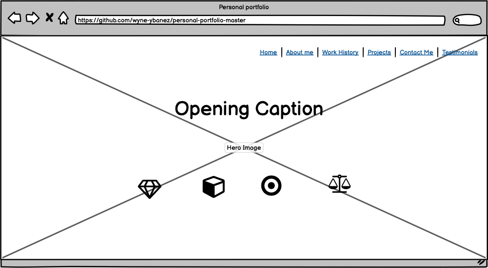
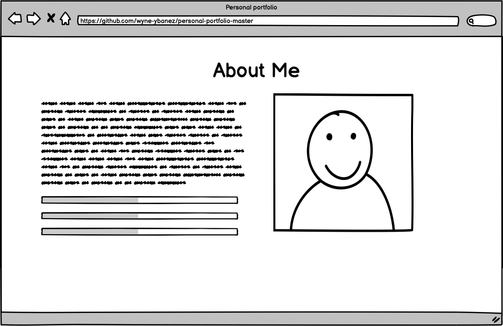
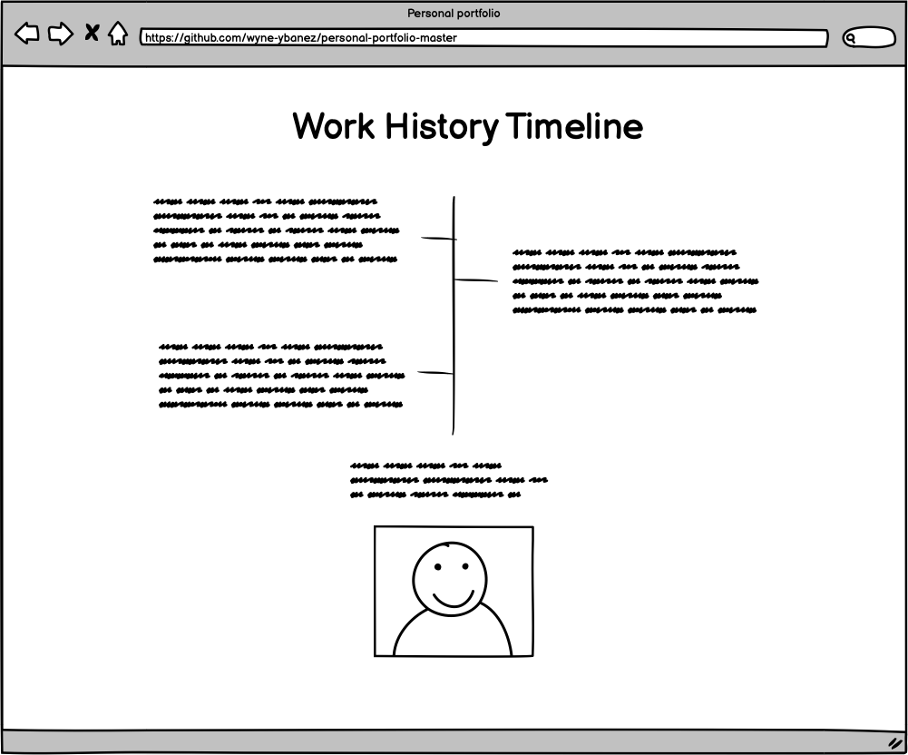
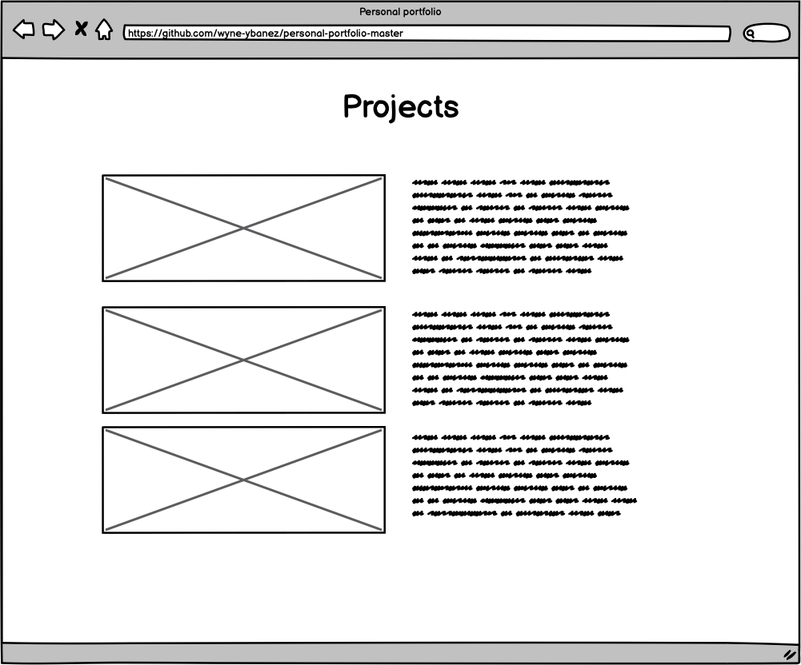
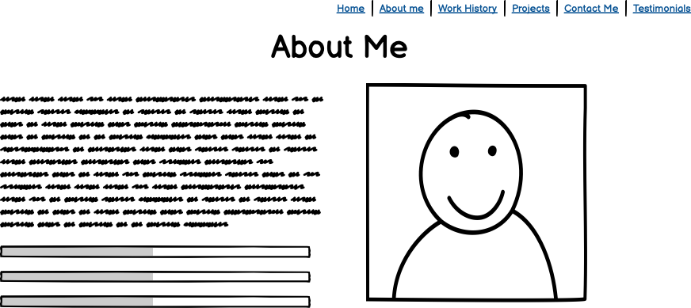
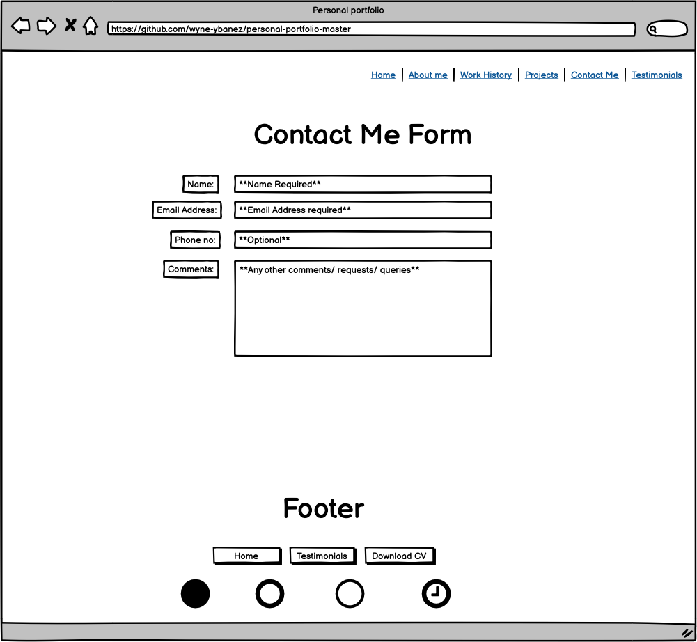
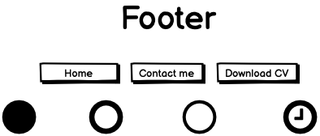
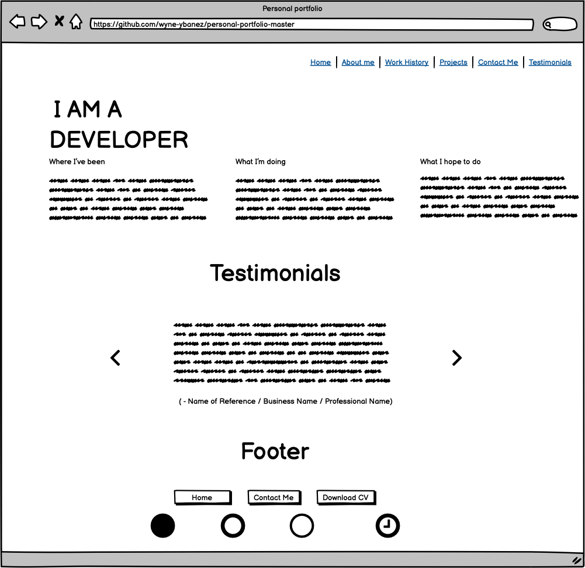

# Code Institute MS1: Personal Portfolio Project

## Project Goal

This project aims to portray a junior software developer in the best light personally, technically and professionally. It should show the personality of the person, what skills and experience they have obtained throughtout their professional life as a developer. The project ultimately intends to pitch the junior developer as an asset to hiring businesses/companies. 

## UX 

The website should allow it's users to automatically identify the reason for why the website was created. In this case, the website is created to appeal to users,recruiters and hiring managers.

- As a recruiter I will have had worked through many resumes in order to find the right candidate. I would want a resume or website resume that can catch my attention from the get and maintain it. 
  
- As a user I would appreciate a website that would be easy to navigate. 

- As a user I would also prefer if the website can communicate the reasoning for its creation from the first instance of perceiving it.

- All interactions and buttons should be responsive, whether I am viewing the website from a mobile phone or hovering over the buttons with a cursor. There should be a indication to confirm what I am doing.

 

## Features

Opening the website: 

- The website should be consistent and objective. It should avoid straying away from promoting the candidate, this may create confusion. 

- The website's main page must navigate to relevant information, either by scrolling up and down or using the navigation links in the navbar. 
  
- As a user or recruiter would like to know about the candidate, their personality/ their experience and skills. This should be on the website & users should be able to find this quickly and easily.

About Me:

Work History Timeline: 

 

Projects: 

 

Transparent Sticky-Navbar: 

- Navigation Bar Code mainly deriving from Bootstrap. 

- If at any point the user should find themselves lost whilst navigating the website, they should be able to return to the home page or to the page they would like to view easily. 

- Users should be able to traverse to any section of the website at any point in time.

- At no point should the navbar distract the user from the information provided on the candidate's website. Hence, it should be transparent.

 

Contact Form: 

- It would be efficient if there was a way for users to contact the candidate at any point of whilst traversing their website.

- This feature will require the user to input their contact details. Namely, the email address and name. If the candidate should ever respond, he/she will then know where/who the response is going to. 

 

Footer:

- When reaching the end point of the website, there may be a further queries users would like to ask the candidate. The 'contact me' feature should be present in preparation for this.

- The footer should have the relevant social links and buttons. These can help users/recruiters to research candidate further to discover more about them. 

- If users would like to read back over information in the previous sections. The footer should allow me to return to the relevant pages ie. Home page.

 

Testimonials: 

- Perhaps users would like to know more about the candidate, about impressions past employers or connections hold towards him/her.

- Should users find themselves in this page, it is probably because they require social proof - "I am looking for a candidate that can be of benefit to us now and in future."

- Users might like to investigate further if this candidate is great match for their organization. These users will want to know the projects he/she has collaborated with, what he/she is doing now and what he/she hopes to be.

 

Responsive: 

- The website should be responsive and confirm all interactions. 

- There should be some sort of indicator or animation that can confirm whenever the user is hovering over a button or clicking on it when using a computer or desktop.

- It should shrink it's windows and align items correctly when the user is minimzing the window or using a mobile phone. 
  
   

## Technologies used 
- HTML
- CSS
- VScode 
- VSCode extension: LiveServer (https://marketplace.visualstudio.com/items?itemName=ritwickdey.LiveServer)
- AOS (https://michalsnik.github.io/aos/)
- HVR (https://github.com/IanLunn/Hover/blob/master/css/hover.css)
- Bootstrap v4.5.3 (https://getbootstrap.com/)

## Deployment

## Credits
## Content 
(written content like wikipedia)
## Media 
(Where the photos were obtained from)
### Acknowledgements
(I received inspiration of this project from)

