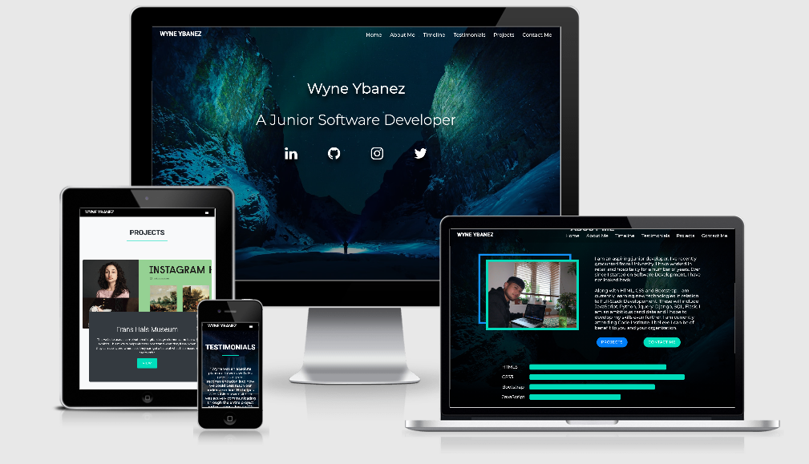
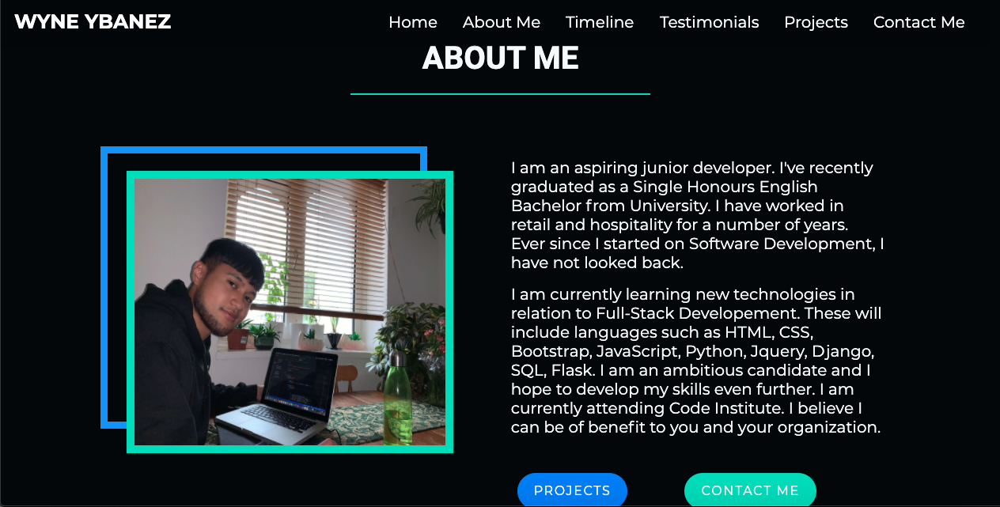
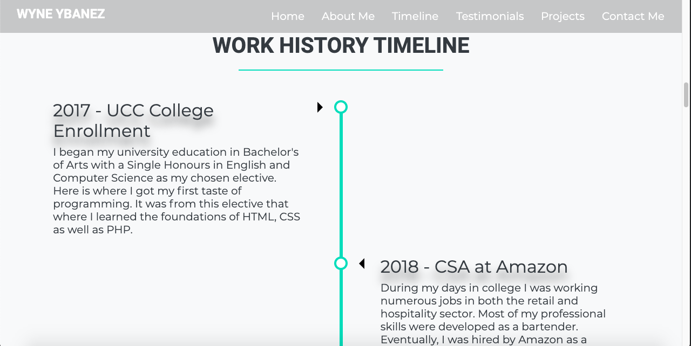
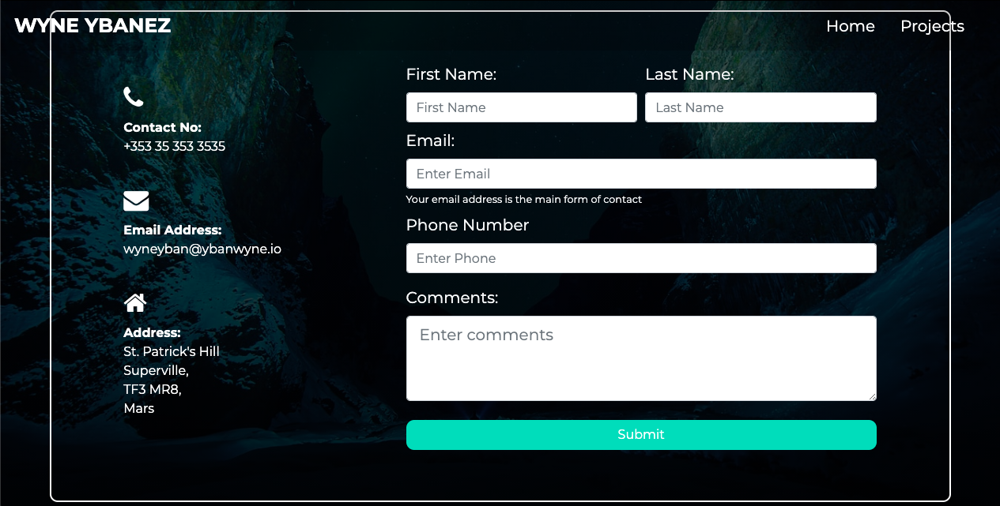
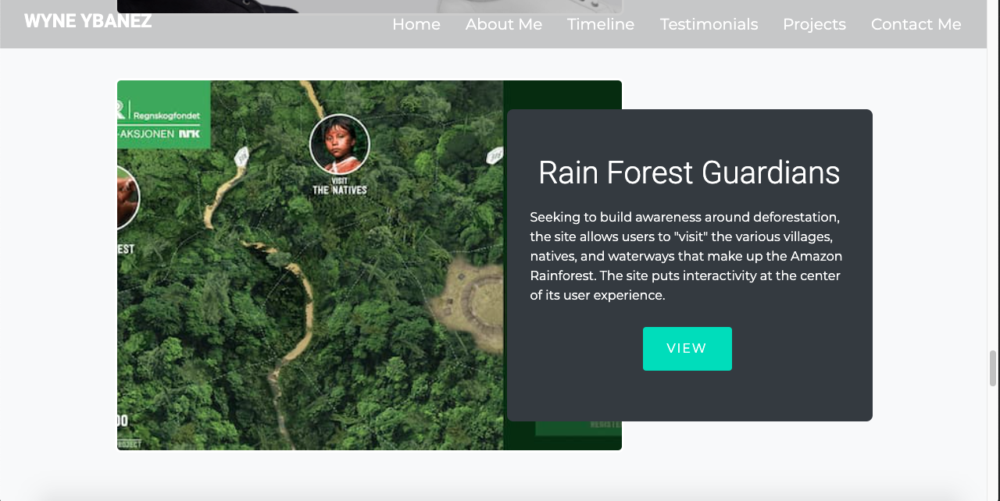
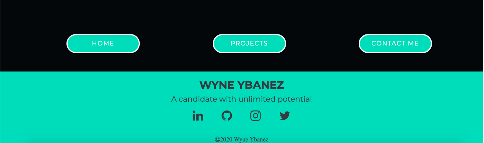

# Code Institute MS1: Personal Portfolio Project



View the live project here: https://wyne-ybanez.github.io/personal-portfolio-master/

## Project Goal

This project aims to portray a junior software developer in the best light personally, technically and professionally. It should show the personality of the person, what skills and experience they have obtained throughout their journey as a developer. The project ultimately intends to pitch the junior developer as an asset to hiring businesses/companies. 

Hence the target audience for this project are recruiters and developers who wish to collaborate with the candidate.

## UX 

### Strategy 

My goal for the website was to allow the user/recruiter to navigate to any section of the website with ease. Additionally, their interactions with the site should be acknowledged. The website aims to entice the user to contact the candidate once they have finished reading the content.

### Scope 

The website will display solely relevant information with regards to the candidate's potential. The start of the website will communicate straight off the bat, what the website was created for. It will provide an overview of the candidate's skills, experience and education. Links are provided should the user wish to contact the candidate ore research him further.

### Structure 

The website incorporates a one page style design. The user will only need to scroll down to digest the content. Every section will lead to a relevant and complimentary section which is designed to maintain the user's interest. The experience should be seamless and at no point in time should the user feel lost.

### Skeleton

These wireframes are the blueprints to the project prior to any coding. These were made to help plan the project, to see how sections were to be arranged and what features could be implemented. Design decisions were made during the production of the website that may stray from what the wireframes initially conveyed.

  [Hero Image](wireframes/hero-img.png)

  [About me](wireframes/about-me.png)

  [Timeline](wireframes/timeline.png) 

  [Sticky Navbar](wireframes/sticky-navbar.png)

  [Contact Me form](wireframes/contact-me.png) 

  [Projects](wireframes/projects.png) 

  [Footer](wireframes/footer.png)

### Surface

I want to provide users and recruiters an immersive experience where the site animates accordingly both to catch the user's attention and acknowledge their actions. Ultimately appealing to the user's senses and making it seem like reading the content is instinctive, nearly second nature. The colors will contrast between white, dark, turquoise and shades of blue. 'Montserrat' will be the main font as this font style looks neat and professional.

## User Stories:

- ### First Time Visitor Goals:

  a. I would like to know the purpose for the creation of the website from the first instance of opening it.
  <br>
  b. I would greatly appreciate it if the website were easy to navigate.
  <br>
  c. I expect the website to display relevant content and stay consistently relevant as I explore the site.
  <br>
  d. I would appreciate it if my interactions with the site were acknowledged so that I know what I am doing and where I am going. 
  <br>
  e. I would like the content to be structured and easy to follow.
  
- ### Returning Visitor Goals:
  
  a. I would like to see in-depth information to the website with regards to how the candidate is improving in his ability to code. 
  <br>
  b. I would like to see if the candidate has completed any coding experience with other businesses.
  <br>
  c. I would like to it if there were a way to contact the candidate and find out more information.

- ### Frequent Visitor Goals: 
  
  a. I would like to check if the candidate is working on any projects.
  <br>
  b. I want to be able to contact the candidate quickly.
  <br>
  c. I want to be able to navigate to any section of the website in order to read it in more detail.

## Design - In Depth

### Colour Scheme 

- The overall project will use the colors turquoise, sky-blue, dark gray and white. 
  * #00DDB8
  * #ffffff
  * #6c757d

- The two main contrasting colours for the project are turquoise and blue. This will be complimented with dark and white background/texts.

### Fonts 

- Montserrat is the font used for the body, it looks clean and professional.
- Roboto is the secondary font - used mainly for headings.
- Sans serif is the fallback font should the fonts be imported incorrectly.

### Opening the website: 

- The website should be consistent and objective. It should avoid straying away from promoting the candidate, this may create confusion. 

[Screenshot](assets/readMe/hero-sc.png)

### About Me:

- To display an overview of the candidate, his current skills, a profile image, a summary text and progression bars of his technical ability

- Unlike the wireframe, the placements of the content has switched

- This section of the page will have a call to action buttons, mainly to 'projects' and 'contact me' section. 
  


### Work History Timeline:

- To display the candidate's past work experience.
  
- Follows the 'Timeline' wireframe accordingly



### Transparent Sticky-Navbar: 

- If at any point the user should find themselves lost whilst navigating the website, they should be able to return to the home page or to the page they would like to view easily. 

- Users should be able to traverse to any section of the website at any point in time.

### Contact Form: 

- It would be efficient if there was a way for users to contact the candidate at any point of whilst traversing their website. There is a button 'contact me' on the navigation bar to help with this.
- This feature will require the user to input their contact details via a contact form. 
- First name and the email address is required. 
- If the candidate should ever respond, he/she will then know where/who the response is going to. 



Screenshot of page that will come after the user send their comments - [link](assets/readMe/thankyou-sc.png)

### Projects: 
  
- It will display 4 projects. The projects will for the mean time link to external third-party websites however, in future I will link my other completed projects to this section.

- It will consist of 4 projects supported by descriptive text at the side just as specified on the wireframe.



### Footer:
  
- When reaching the end point of the website, there may be a further queries users would like to ask the candidate.
  
- Perhaps the user would like to read back over to the previous content. 
  
- The footer should have the relevant social links and navigation links. These can help users/recruiters to research candidate further or go back over specific content. 



## Features

### Responsive: 

  The website should be responsive and confirm all interactions. 

  There should be some sort of indicator or animation that can confirm whenever the user is hovering over a button or clicking on it when using a computer or desktop.

  It should shrink windows and align items correctly when the user is minimizing the window or using a mobile phone. The website should be responsive when viewed on modern devices.

  The website should function accordingly in modern web browsers.

### Interactive: 

  The user should be able to interact with the website and function according to the given text
  i.e. Clicking on 'Contact Me' should bring the user to 'contact.html'.

  Fade animations should be present on accordingly as the user scrolls down.
  
### Convenience: 

  The user should be able to navigate the website at any point in time.
  
  The content of the website should stay relevant and appropriate. 

  The buttons leading to separate pages should appear in good time in preparation for the user's desire to know more about the candidate.

  The content should be clear and presented without any distractions. Ideally the user should know where and what part of the website they are reading/exploring.

## Testing 
  
I have added the testing onto a separate .md file as its content has increased exponentially, here is the [link](https://github.com/wyne-ybanez/personal-portfolio-master/blob/main/TESTING.md)

## Technologies used:

### Languages
-  [HTML5](https://en.wikipedia.org/wiki/HTML5)
-  [CSS3](https://en.wikipedia.org/wiki/Cascading_Style_Sheets)
-  [JavaScript](https://en.wikipedia.org/wiki/JavaScript)
  
### IDE
- [VScode:](https://code.visualstudio.com/) - The IDE used to code the website. 
- VSCode extension: [LiveServer](https://marketplace.visualstudio.com/items?itemName=ritwickdey.LiveServer)

### Frameworks, Libraries, CDN's, Resources etc.
1. [AOS:](https://michalsnik.github.io/aos/) 
    - This JS library was used for the animations on scroll.
2. [HVR:](https://github.com/IanLunn/Hover/blob/master/css/hover.css)
    - This library was used for the hover effects of the navbar items.
3. [Bootstrapv4.5.3:](https://getbootstrap.com/) 
    - Bootstrap was used for the overall components documentation and responsiveness of the website.
4. [W3Schools](https://www.w3schools.com/)
    - Documentation for Media Queries and CSS when I encountered bugs.
5. [Balsamiq:](https://balsamiq.com/)
    - Balsamiq was used to create the wireframes during the design process.
6. [GitHub:](https://github.com/)
    - GitHub is used to store the projects code after being pushed from Git.
7. [Git](https://git-scm.com/)
    - Git was used for version control by utilizing the Gitpod terminal to commit to Git and Push to GitHub.
8. [Font Awesome:](https://fontawesome.com/)
    - Font Awesome was used on all pages throughout the website to add icons for aesthetic and UX purposes.
9.  [Google Fonts:](https://fonts.google.com/)
    - Google fonts were used to import 'Roboto' and 'Montserrat' as the chosen styled fonts for the site.
10. [Chrome Developer Tools:](https://developers.google.com/web/tools/chrome-devtools)
    - Used to debug and style with css for the whole project.
    - Used for media queries
11. [Ami Responsive](http://ami.responsivedesign.is/#)
    - Used to test for website responsiveness and media query establishment
12. [EmailJS](https://www.emailjs.com/)
    - Used to send emails to the developer if the user would like to contact the candidate directly

## Deployment

### Github

1. Log into Github and Locate the relevant repository. Here is a [link](https://github.com/wyne-ybanez/personal-portfolio-master)  
2. Click on the settings buttons on the horizontal menu
3. Scrolling down until you reach "Github pages" 
4. There is a heading named "Source". There is a button underneath it. Click on that button and change it from "none" to "main". Then click "save"
5. You will have to scroll down to the heading "Github Pages". The published [site](https://wyne-ybanez.github.io/personal-portfolio-master/) with the link should be there.   

### Forking the Repository

You can fork the repository through the following steps. Forking the repository means you will have a copy of the repository and any changes you make will not affect the original repository.

1. Log in to GitHub and locate the GitHub Repository. Here is a link for the [repository](https://github.com/wyne-ybanez/personal-portfolio-master)
2. At the top of the Repository (not top of page) just above the "Settings" Button on the menu. Looking towards the right of the page. Locate the button "Fork" then click 
3. You should now have a copy of the original repository in your GitHub account

### Local Clone

This is used when you would like to make changes to the project code

1. Should you wish to use a different IDE like VSCode. You first log in to Github and locate the required repository. Here is the link for this [repository](https://github.com/wyne-ybanez/personal-portfolio-master)
2. Open a new terminal on Git Bash
3. Type `git clone`, and then paste the URL you copied 

```
$ git clone https://github.com/wyne-ybanez/personal-portfolio-master
```

 Here is a link that can explain this process further. [Click Here](https://help.github.com/en/github/creating-cloning-and-archiving-repositories/cloning-a-repository#cloning-a-repository-to-github-desktop)

## Credits

### Code 

- Animate on Scroll used throughout the entire website. Check it out [here](https://michalsnik.github.io/aos/)
- Hover Animation for the [Navbar](https://github.com/IanLunn/Hover/blob/master/css/hover.css)
- Transparent Navbar Code from Stack Overflow - Here's the [link](https://stackoverflow.com/questions/16453537/bootstrap-transparent-navbar) 
- How to keep the navbar sticky. This is the [solution](https://www.w3schools.com/howto/howto_js_navbar_sticky.asp)
- Transparent Navbar with scroll effect when scrolling [solution](https://stackoverflow.com/questions/29646622/set-bootstrap-navbar-transparency-on-scroll)
- Solution for full page background Image. This is the [website](https://css-tricks.com/perfect-full-page-background-image/)
- Solution to darken the background image from [stackoverflow](https://stackoverflow.com/questions/23208200/how-to-darken-a-background-using-css/36390220)
- About Me second border behind the main image [border](https://github.com/WebCifar/one-page-website-html-css-project-for-practice)
- Work History Timeline [guide](https://www.w3schools.com/howto/howto_css_timeline.asp)
- Documentation for Bootstrap Carousel for [Testimonials](https://getbootstrap.com/docs/4.5/components/carousel/)
- Documentation for Bootstrap [Contact Form](https://getbootstrap.com/docs/4.0/components/forms/) 
- Adam Sky's code solution to center icons for the footer - here is his github [repo](https://github.com/Adamsky94/milestone1/blob/master/index.html)
- Underlining the Heading with adjustable border - this is the [solution](https://www.steckinsights.com/shorten-length-border-bottom-pure-css/)
- Debug solution for unconnected underline after icon. [Click Here to see bug](assets/tests/social-link-error.png). This link will lead you to the [solution](https://stackoverflow.com/questions/33835756/after-including-bootstrap-icons-get-weird-underline)
- WebCifar's code used for the Projects Section [design](https://codepen.io/Web_Cifar/pen/dyXNVep)
- Form validation debug solution (by user 'ralphm') found in this [forum](https://www.sitepoint.com/community/t/turn-form-button-into-hyperlink/16244)
- MDBootstrap.com - Footer [guide](https://mdbootstrap.com/docs/jquery/navigation/footer/)
- Icon Hover [Effects](https://codepen.io/nxworld/pen/ZYNOBZ?fbclid=IwAR1C0Fp-oCTJS1KfeV7TDmL_3KJNneOL146xKX0Y1Bl6UbP6X6TSF_SKV-k)
- Website [favicon](https://favicon.io/favicon-generator/)

### Git Bash Code

- I had initially started the project with a local IDE and a local username. I forgot to configure and log the right username and email for the author. Hence, my initial contributions were not counted by Github. The solution as to how to change the author/committer email and user name is found [here](https://stackoverflow.com/questions/750172/how-to-change-the-author-and-committer-name-and-e-mail-of-multiple-commits-in-gi)
  
### Content
- Index.html content was created originally
- ReadMe content for how to clone a repo in depth. This is the [link](https://docs.github.com/en/free-pro-team@latest/github/creating-cloning-and-archiving-repositories/cloning-a-repository#cloning-a-repository-to-github-desktop)

### Media 

- Image for Banner Section obtained from [Unsplash](https://unsplash.com/photos/3l3RwQdHRHg)
- Image for About Me Section is original
- Images for projects section obtained from [Hubspot's Blog](https://blog.hubspot.com/marketing/best-website-designs-list)
- Timeline Ending image obtained from [Daily tuition](https://github.com/akashyap2013/PortFolio_Website)

## Known Bugs

- There is a bug with the carousel indicator `.carousel-indicators li` by which the indicators move up and down when the testimonial section is viewed on mobile device (iPhone 6, 7, 8).

- When viewed on the Macbook Air 2015 - 13", there was a bug where the blue border behind the "About me" image was not styled properly. The `height` and the `bottom` position the blue border did not apply the styles specified in style.css. However, upon viewing it on the Macbook Pro - 13" and testing on [ami responsive](http://ami.responsivedesign.is/#), the border followed its styling accordingly. 
  
- When viewed on Github pages using a physical mobile phone, the hero image is not clear nor is it fully presented. The hero image looks zoomed in and the alignment is unknown.

## Design Changes 

- The website used to incorporate a black background, this has been changed to a white background. Text colors and section backgrounds have been changed accordingly

- Previously, the website would link externally to 'projects.html' and 'contactme.html'. These files have been deleted and instead the site incorporates a one page design.

- Previously, it was planned that the Footer would have 3 navigation buttons as specified in the Wireframes. This has been altered and now the footer will now contain navigation links, social icons as well as contact information.

- Sending an email to the candidate initially directed the user to a page 'thankyou.html'. This page has been removed through the implementation of EmailJS. The user will not remain in the portfolio website.

- Removed the progression bar from 'About Me' section and updated with font-awesome icons to represent coding languages of which the candidate is proficient with.

- Migration of CSS framework from Bootstrap 4 to Bootstrap 5

## Future Implementations 

- I would like to style further media queries for the website
- To add a download cv button in the options menu or the footer
- To code additional Javascript animations on the website in future

## Acknowledgements

- One page style website, About me section design, Project Section styling and Footer design inspired by WebCifar (Shaif Arfan).
- I received Inspiration for the social icons within the Banner section from Code Institute Student David O' Shea, his MS1 [Project](https://www.grahamsweeney.ie/)
- Timeline Section inspired by [Code Institute](https://codeinstitute.net/)
- My Mentor Dick Vlaanderen for his continuous feedback
- Tutors at Code Institute for their on-going support
- Jim Lynx a Code Institute lead who provided me invaluable insight 
- Code Institute's Slack community which provided me with ideas as to how to approach the project


